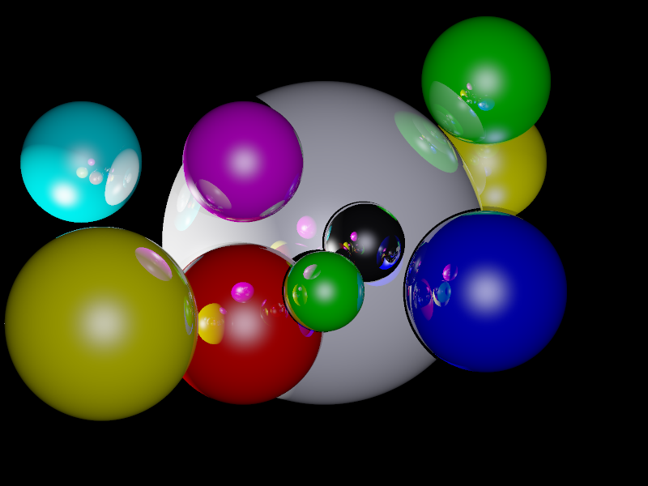

Ray Tracing with Java
=====================
Here is the output of my first ray tracing experiment. Three light
sources have been defined in this scene. The first one is to the left
side of the scene. The second one is behind the camera shining directly
infront of the dark blue sphere. The third one is behind the blue sphere
between the white sphere and the yellow sphere behind it.

It uses orthographic projection to trace the rays. It means that the
apparent size of the object does not change with the distance from the
camera and there is no vanishing point in the image. I need to learn
conic projection to achieve this. The concepts of diffusion, reflection
and specularity have been used to do the ray tracing. Antialiasing is
achieved by 4x supersampling.

The code was written in Java from scratch. Nothing outside the standard
library has been used.

Build and Run With Ant
----------------------
 1. Run the following command to build the project:

        ant

 2. Once the above command completes successfully, a 'raytracer.jar' file
    will be created in 'dist' directory.

 3. It can be executed in one of the following ways:

        ant run
        java -jar dist/raytracer.jar

 4. An [output.bmp](output.bmp) file will be created as the output.

 5. To build the API documentation run:

        ant javadoc

    The documentation can be seen by opening 'dist/docs/api/index.html'.

 7. To clean up the build directories, run the following command:

        ant clean

    The above command will delete the 'build' and 'dist' directories.
    Source code will not be deleted and the project can be built again
    by following the steps mentioned in this section.

Build and Run Without Ant
-------------------------
 1. Execute the following commands to build the project:

        mkdir build
        javac -sourcepath src -d build src/in/susam/raytracing/RayTracer.java
        mkdir dist
        jar -cmf src/Manifest.mf dist/raytracer.jar -C build .

 2. Once the project is built, it can be executed as follows:

        java -jar dist/raytracer.jar

 3. An [output.bmp](output.bmp) file will be created when the program
    terminates.

 4. To build the documentation run:

        javadoc -private -d dist/docs/api -sourcepath src/ -subpackages in.susam

    To clean up the build directories delete the 'build' and 'dist'
    directories.

License
-------
This is free and open source software. You can use, copy, modify,
merge, publish, distribute, sublicense, and/or sell copies of it,
under the terms of the MIT License. See [LICENSE.md][L] for details.

This software is provided "AS IS", WITHOUT WARRANTY OF ANY KIND,
express or implied. See [LICENSE.md][L] for details.

[L]: LICENSE.md
